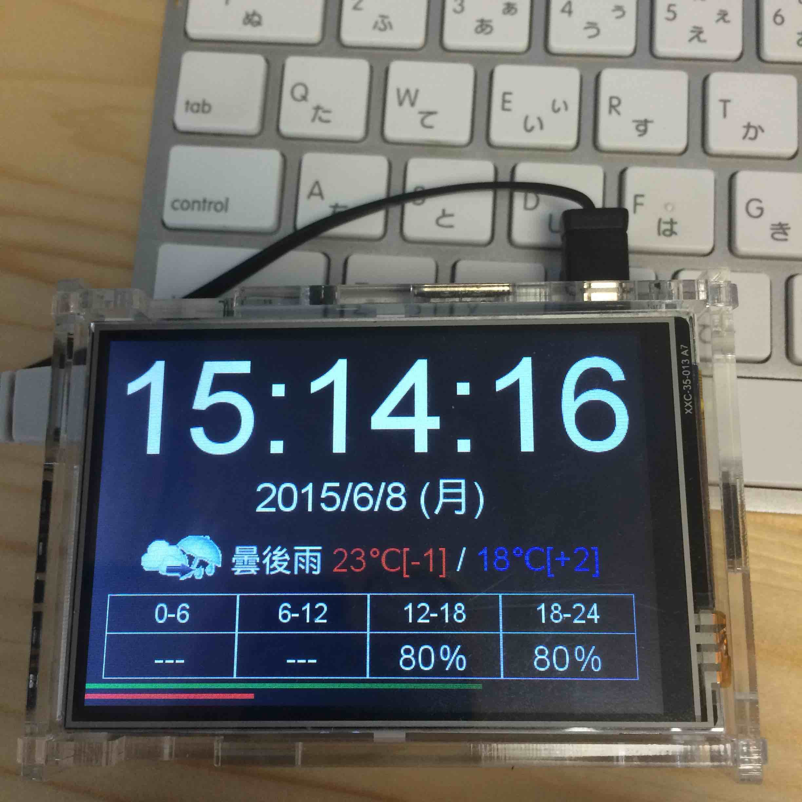

# pi_weather
このリポジトリはPaspberry Pi(pi) + LCDディスプレイで 天気予報付き置き時計を作るための、気象情報取得と、表示用htmlが入っています。

詳しくは以下の記事をご覧ください  
[LCDディスプレイを取り付けて天気予報付き置き時計にする](http://blog.o24.me/?p=749)



## ディレクトリ構成
* client
pi上で表示させるhtmlです。

* script
yahoo天気から気象情報を取得するスクリプトです。  
取得の間隔はYahooに迷惑をかけないようにしましょう。

## システム構成
以下が必要になります。  
入ってない方はインストールしてください。

* ruby (動作検証済み:ruby 2.1.5p273)

* git

* apache2

## セットアップ
必要最低限のセットアップを記載します。  
既にapacheが動いている方など環境によってはカスタマイズが必要な場合もあります。

**!!ここからはpi(root)での作業になります。!!**

### ssh ログイン
```
ssh root@pi
```

### interfaces設定
localhostへアクセスできない場合、以下を設定

```
vi /etc/network/interfaces

# 追記
auto lo
```

### リポジトリclone
```
mkdir /git
cd /git
git clone https://github.com/o24/pi_weather.git
```

### 必要な地域の登録
```
cd /git/pi_weather/script/
vi config.rb
```

以下の`AREA_ID`, `ZONE_ID`を設定します
```
# 都道府県
AREA_ID = "34"
# 北部、南部など
ZONE_ID = "6710"
```

### rubyインストール
以下のgemが必要です。  
rubyインストール後実行してください。

```
gem install nokogiri pry pry-byebug
```

### cron登録
cronでrubyを実行する場合は、癖があるので注意
```
crontab -e

# 内容
# 以下は1時間に1回取得
* 1 * * * cd /git/pi_weather; /root/.rbenv/shims/ruby /git/pi_weather/script/run.rb > /dev/null
```

### apacheインストール
```
apt-get update
apt-get upgrade

apt-get install apache2

```

### apache自動起動
```
cd /etc/rc2.d
mv S02apache2 S20apache2
```

### apache設定

```
vi /etc/apache2/apache2.conf

```

```
# 以下追記
DocumentRoot "/var/www"
<Directory "/var/www">
    Options FollowSymLinks
</Directory>

```

### apache 再起動
```
/etc/init.d/apache2 restart
```

### LCDディスプレイ組み立て、フルスクリーン化について
以下を参考に    
[LCDディスプレイを取り付けて天気予報付き置き時計にする](http://blog.o24.me/?p=749)
